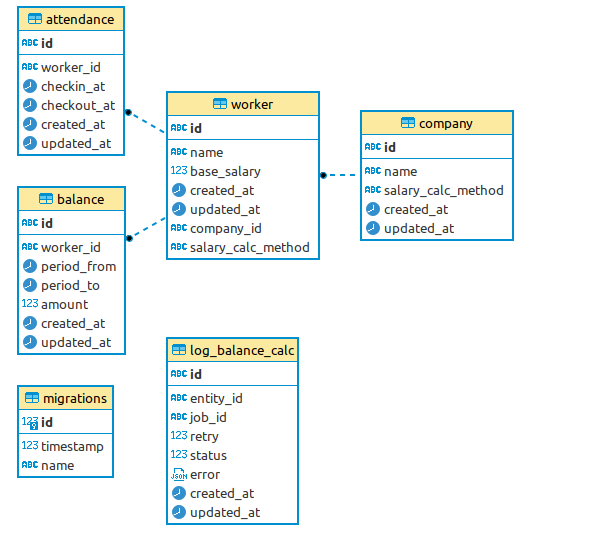
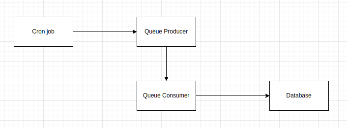

## Overview
This app is solution for calculating workers' balances every midnight using [NestJS](https://nestjs.com/)

### Database Design

- worker: store employee records
- company: store company records. Each company has many workers
- balance: store workers' balances records
- attendance: store workers' attendance records
- log_balance_calc: store logs when calculating workers' balances

### Logic Flow
Main solution is to scan company table, synchronously handle each company with queue and asynchronously handle all members of that company using Promise.all and batching technique.


- Every midnight, there is a [cronjob](./src/modules/balance/balance-job.service.ts) executed.
- Cronjob scans company table, loops over all company records and pushs each company into queue.
- In each queue, when [queue consumer](./src/modules/balance/balance-calc.consumer.ts) receives queue producer data, it scans woker table records which in the processing company. Then, queue consumer will handle the calculation of workers' balances by using Promise.all and batching requests (about 100 request per batch) to take advantage of datbase connection pools.
- For example, there are 2 companies, A and B. A and B will be pushed into queue. When queue consumer processes company A, it will get all its workers, we suppose there are about 300 workers. Consumer will seperate 300 workers into 3 batches, each batch has 100 workers, and then loop over 3 batches to execute Promise.all on each batch. Company B will be handled in the same way.
- If this app runs with multiple instances, there is no need to worry about that some companies will be handled in duplicate, because each job in queue has its own UNIQUE id. If this id already exists in queue, it will not be re-pushed into queue again. We can take this advantage by using company id for job id.

### Design pattern
Apply strategy pattern to calculate balances. [See interface](./src/modules/balance/interfaces/balance-calc.interface.ts)

## Development

### Requirements
- [Docker](https://www.docker.com/) v9 or newer
- [Docker compose](https://docs.docker.com/compose/) v2 or newer
- [NodeJS](https://nodejs.org/en) v16 -> v18 LTS
- [Yarn](https://classic.yarnpkg.com/lang/en/docs/) v1.22.x

### Installation
- Install your project dependencies
```bash
yarn install
```
- Setup environment
```bash
cp .env.example .env
```

### Quick start
- Run database container
```bash
docker compose up -d
```
- To stop containers, run
```bash
docker compose down
```

### Running the app
- Initial database schemas
```bash
yarn migration:up
```

- Run your app in local environment
```bash
yarn run start:dev
```

### Migrations
To update database schema, you have to use migrations
- Create migration file
```bash
yarn migration:create src/migrations/<file name>
```
- Apply those changes to database
```bash
yarn migration:up
```
- Revert changes
```bash
yarn migration:down
```
